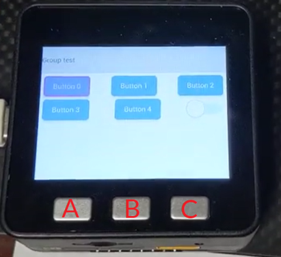
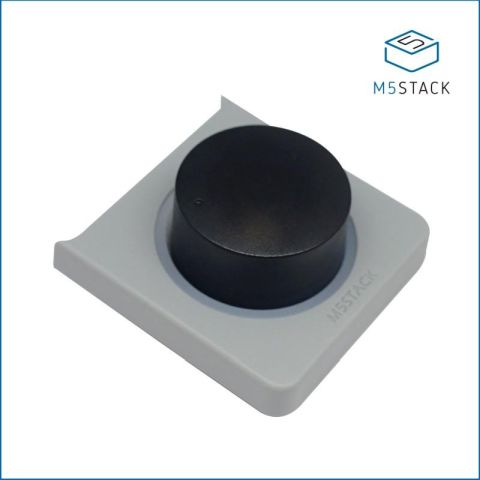

# M5Stack LittlevGL MicroPython library <!-- omit in toc -->

Table of contents:

- [Install](#install)
- [License](#license)
- [Contributors](#contributors)

[M5Stack][m5] LittlevGL MicroPython library; including ILI3941 display driver
and input drivers for:

 - M5Stack buttons (i.e., A, B, C on core)  
   
 - [Faces Encoder Panel][faces-encoder]  
   [][faces-encoder] 

-------------------------------------------------------------------------------

# Install

The latest [`m5-lvgl` release][1] is available as a
[Conda][2] package from the [`sci-bots`][2] channel.

To install `m5-lvgl` in an **activated Conda environment**, run:

    conda install -c sci-bots -c conda-forge m5-lvgl

-------------------------------------------------------------------------------

# License

This project is licensed under the terms of the [BSD license](/LICENSE.md)

-------------------------------------------------------------------------------

# Contributors

 - Christian Fobel ([@sci-bots](https://github.com/sci-bots))

[1]: https://github.com/sci-bots/m5-lvgl
[2]: https://anaconda.org/sci-bots/m5-lvgl
[m5]: https://m5stack.com
[faces-encoder]: https://m5stack.com/collections/m5-module/products/encoder-module